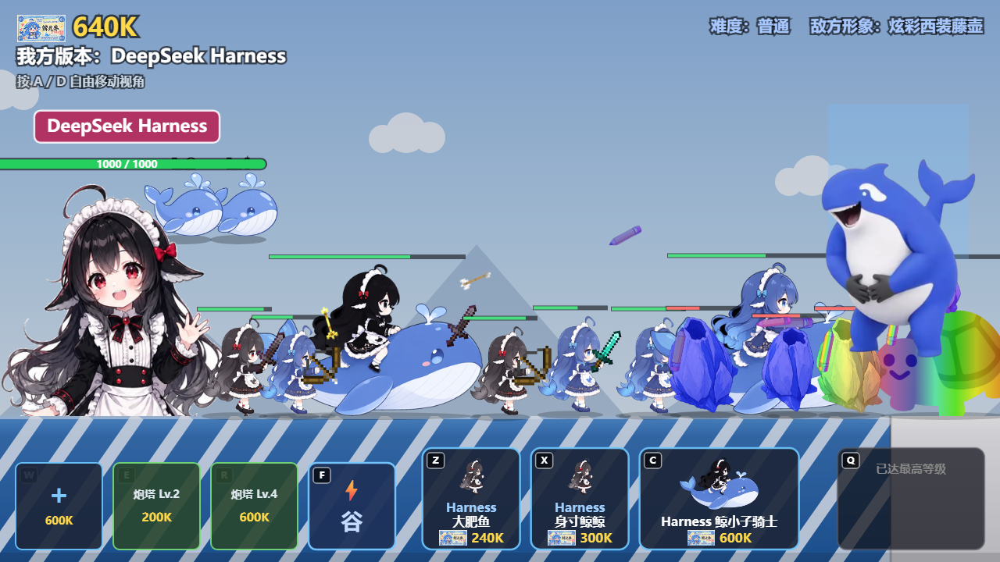

# 藤壶的入侵

纯前端横版推塔小游戏：**造兵、升基地、建炮塔，推平对面的藤壶母巢。**
没有构建步骤、没有依赖、没有后端 —— 一个 `index.html` + 20 个 `<script>` 就是全部。

### 🎮 在线试玩：[https://yfuwd.github.io/Barnacle-Invasion/](https://yfuwd.github.io/Barnacle-Invasion/)

> 链接里的 `Barnacle-Invasion` **大小写要照抄**：GitHub Pages 的路径区分大小写，
> 写成全小写的 `barnacle-invasion` 会 404。

点开就玩，手机 / 平板 / 电脑都行（触屏点按钮，键盘用快捷键）。



---

## 怎么玩

打开先选难度：**简单 / 普通 / 困难**（或按 `1` `2` `3`）。
目标是打爆对面的敌方基地；你的基地被打爆就算输。

| 操作 | 键盘 | 鼠标 / 触屏 |
| --- | --- | --- |
| 出兵（当前等级的第 1 / 2 / 3 个兵种） | `Z` `X` `C` | 点底部兵种按钮 |
| 升级基地（解锁下一级兵种） | `Q` | 点右下角「升级基地」 |
| 炮塔：后槽 / 中槽 / 前槽（空着=建造，已建=升级） | `W` `E` `R` | 点左下角三个槽位 |
| 技能：梁文（谷）时段 | `F` | 点技能按钮 |
| 平移视角（不会自动跟兵） | 按住 `A` / `D` | **在空白处按住拖动** |
| 切换游戏速度（**默认 2×**） | `1` `2` `3` `4` = 1× / 2× / 10× / 5× | 点右上角「倍速 2×」（手机，在 2× ⇄ 5× 间切） |
| 静音 / 恢复 | `M` | — |
| 强制横屏（手机） | `L` | 点右上角「⤢ 横屏」 |
| 结算界面重开一局 | `R` / 空格 | 点重开按钮 |

> `R` 在对局里是"前炮塔"，只有在结算界面上才是"重开"。

## 手机 / 平板

**同一个链接**，打开时自动判断设备，不用换地址、也不用装 App：

- **PC / 平板**：布局跟着窗口大小走（和以前一样），没多任何东西
- **手机竖屏**：底部按钮排成三排（最下出兵 / 中间炮塔 / 上面技能 + 升级），
  字号收紧，**手指在空白处拖动就能平移视角**（手机没有 A/D 键）
- **手机横屏**：回到一整排的宽屏布局
- **刘海 / 小白条**：用 `env(safe-area-inset-*)` 自动避让，按钮不会被挡住
- 手机竖屏时整个世界会缩小到约 0.54 倍 —— 否则 390px 宽的屏幕只看得到 390 世界像素
- 对局中右上角有两个开关：**「倍速 2×」（2× ⇄ 5×）** 和 **「⤢ 横屏」**，倍速在横屏左边
- **主菜单底部有操作说明**：电脑显示键盘键位（`Z/X/C` 出兵这种），手机显示触屏操作
  （点按 / 拖动 / 右上角）。屏幕太矮（比如手机横屏）就不画，免得挤在一起
- 触屏笔记本不会被当成手机：判定要求"主指针是手指"或"UA 是手机系统"或"有触点**且屏幕小**"
  （`maxTouchPoints` 在触屏 PC 上是 10，只看它会把电脑当手机）

### 全屏横屏

**手机竖屏第一次打开**会直接弹一个询问框「要用全屏横屏玩吗？」：

- 点 **「全屏 + 横屏」**：先进全屏，再旋转（Android Chrome 用原生
  `screen.orientation.lock('landscape')`，屏幕真的转过去；iOS Safari 没有这个 API，
  就把画面在画布内转 90° 兜底 —— **这时要把手机横过来拿**）
- 点 **「先不用，竖屏玩」**：竖屏三排布局照常玩

答案存在 `localStorage`（`barnacle.askFullscreen`），之后不再追问。
随时可以点右上角的「⤢ 横屏关 / ⤡ 横屏开」药丸切换（键盘 `L` 也行）。

> 浏览器规定 `requestFullscreen()` 必须由用户手势触发，页面刚打开时点不了，
> 所以第一次触摸画面时会自动补一次原生旋转 —— 之前选过"全屏横屏"的话，
> 点一下就从"画面旋转"升级成真正的屏幕旋转。

### 三系兵种

每升一级基地会解锁两个基础兵 + 一种骑兵，骑兵要**单独花 Token 解锁**（点它 / 按 `C`），
解锁有 15 秒倒计时，期间不能出兵；每次升级基地后骑兵要重新解锁一次。

- **大肥鱼**（近战，抗线）：血最厚，站定打，手里那把剑按等级换（木 / 石 / 铁 / 钻石 / 下界合金）
- **身寸鲸鲸**（远程，输出）：脆，靠射程在后方丢箭矢，拉弓按攻击冷却走 4 帧动画
- **鲸小子骑士**（近战，贵）：血量极高、横向占 4 个身位，一次撞穿一排

> 出兵按钮上的标签是"**当前基地版本 + 兵种**"，版本按等级取 `V2 / R1 / Pro / Flash / Harness`
> （见 `ERA_TAGS`）。`Harness 大肥鱼` 这种太长的一行放不下就自动拆成两行，
> 贴图会让位缩到文字上方，不会压在一起。

### 资源与升级

- **Token**：双方每 0.2 秒 +1000（每秒 5000）。我方升级基地除了点数还要一次性扣 Token：50K / 100K / 150K / 150K / 300K
- **升级点数**：每秒 +1；击杀敌人额外 +1（杀骑兵 +2）。升到 Lv.2~Lv.5 分别需要 110 / 100 / 140 / 150 点
- **击杀奖励**：10000 × 目标等级 的 Token。敌方 AI 也拿这份钱，而且它每杀一个会让自己的升级时间提前 2 秒（杀骑兵 3 秒）
- **兵种价格**（按等级，单位 K）：战士 50/80/140/180/240、弓手 60/100/160/200/300、骑兵 140/240/400/500/600
- **基地**：初始 1000 HP，各等级上限 1000/2000/3500/5500/8000；Lv.1~Lv.3 挨打时伤害减半，每秒回血 = 当前等级

### 敌方与随机事件

- 敌方基地**按时间表自动升级**：0 / 140 / 240 / 360 / 510 秒 → Lv.1~Lv.5（简单难度每级再延后 10~20 秒）
- 难度只改单位的强度：敌方 简单 0.8×（其中 Lv.4/Lv.5 的敌人 0.7×）、普通 1.0×、困难 1.1×；
  **简单难度下我方 Lv.5 额外补 1.2× 攻击与生命**（后期不至于打不动）
- **普通难度 Lv.5 的敌人被单独削过**（`CONFIG.enemyWealthByDifficulty` / `normalLv5CavalryNerf`）：
  - 财富倍率 1.2 → **0.7**：每秒入账实测 18000 → **10500**
  - 它的 Lv.5 骑兵 hp / dmg 再 ×0.7：3000 血 / 300 伤 → **2100 血 / 210 伤**
  - 起因：那一级钱多到 AI 只攒钱买骑兵（5 分钟一个步兵都不出），
    骑兵平均每 33 秒来一个；削完是**每 60 秒一个**
- **炮塔**：射程 660（每升一级 +10），伤害 10/20/30/40/50，攻击间隔 1 秒，建造要 10 秒，等级不能超过基地等级
- **奶鲸事件**：每 40~70 秒随机砸下 1~3 个，落点范围内的单位掉 60% 最大生命 +20 —— 双方的兵一起掉

---

## 本地怎么跑

```
双击 index.html 就能玩
```

`file://` 直接打开也行，20 个脚本都是普通 `<script>`（不是 ES module），共享全局作用域。
想用本地服务器（更接近线上环境）：

```bash
python -m http.server 8000      # 然后开 http://127.0.0.1:8000/
```

## 声音

- **背景音乐** `audio/bgm.m4a`：循环播放，音量 0.34（比音效轻），点难度菜单/重开时开始
- **胜利音效** `audio/victory.m4a`：打爆敌方基地时播
- **其余音效都是现场合成的**（Web Audio，`js/00_audio.js`）：出兵 / 射箭 / 命中 / 阵亡 /
  升级基地 / 解锁骑兵 / 建升级炮塔 / 炮塔开火 / 技能 / 敌升级 / 奶鲸砸下 / 战败小调 ——
  不占体积、也不会因为文件加载失败而报错
- 浏览器的自动播放策略要求"先有用户手势"，所以 `AudioContext` 是第一次点击/按键时才建的；
  音频文件在 `file://` 下也能放（`<audio>` 不受 CORS 限制）
- 按 `M` 静音；没装 `<audio>` 的环境（比如无头测试）会自动整体静音，不会抛错

## 目录结构

```
藤壶的入侵/
├─ index.html              只负责按顺序引入 20 个 js
├─ preview.png             README / 分享链接用的截图
├─ LICENSE                 MIT
├─ css/style.css           页面底色、字体、禁止选中
├─ 素材/                   美术（由 _tools/build_assets.py 从 藤壶的入侵素材库/ 生成）
├─ audio/                  背景音乐 + 胜利音效（同样由 build_assets.py 拷过来）
├─ 藤壶的入侵素材库/        原始素材与加工中间件（不参与运行）
├─ js/                     所有逻辑，编号 = 加载顺序
│  ├─ 00_audio.js          背景音乐 / 胜利音效 / 合成音效（排最前，好让别处直接调 SFX.xxx）
│  ├─ 01_config.js         画布/视口、世界尺寸 CONFIG、配色、炮塔/奶鲸/技能参数、素材槽位
│  ├─ 02_utils.js          clamp / rand / roundRect / shade / formatGold / formatTime / unitMinDist / overlapsBase / hitTest / fitSprite
│  ├─ 03_assets.js         图片异步加载（加载不出来自动退回程序绘制）
│  ├─ 04_state.js          camX / keys / gameSpeed / spawnQueue / game / ui
│  ├─ 05_units.js          兵种数值表 UNIT_DB + 基地等级表 ERAS + 立绘查询
│  ├─ 06_base.js           两个基地 + 受击/阵亡结算 + resetBases
│  ├─ 07_spawn.js          出生点、出兵队列、花费表、骑兵解锁
│  ├─ 08_combat.js         伤害、飘字、粒子、攻击、投射物、炮塔、技能、奶鲸
│  ├─ 09_ai.js             敌方出兵 AI
│  ├─ 10_camera.js         视角平移
│  ├─ 11_update.js         单位决策、移动碰撞、主更新、结算
│  ├─ 12_render_sky.js     天空与远景（视差）+ 技能「梁文谷时刻」背景
│  ├─ 13_render_terrain.js 三段地形（含斜条纹）
│  ├─ 14_render_base.js    基地立绘/方块、等级牌、血条
│  ├─ 15_render_unit.js    单位立绘（走路帧/受伤帧）、武器、血条
│  ├─ 16_render_fx.js      投射物、奶鲸、粒子、主渲染顺序 render()
│  ├─ 17_ui.js             尺寸/布局、难度菜单、敌方升级面板、按钮栏、结算与重开
│  ├─ 18_input.js          指针 + 键盘操作
│  └─ 19_main.js           lastTime / loop / 启动
└─ _tools/                 自检脚本（不影响游戏运行）
   ├─ build_assets.py      从 藤壶的入侵素材库/ 生成 素材/
   ├─ check.mjs            语法 + 加载顺序 + 跨文件引用检查
   ├─ smoke.mjs            无头冒烟测试：在 Node 里把游戏跑 6 分钟
   ├─ _shots/              渲染检查用的截图
   └─ _compare.mjs         A/B 对拍：拆分版 vs 原始单文件，逐帧比对状态
```

**改动时保持"编号小的在前"**，`check.mjs` 会帮你验证。

## 自检

```bash
node _tools/check.mjs     # 2 秒，改完代码跑一下
node _tools/smoke.mjs     # 1 分钟左右，改完玩法跑一下
```

`check.mjs`：逐文件语法检查、`index.html` 的引入顺序和 `js/` 目录是否对得上、跨文件"用了但没定义"的粗查。

`smoke.mjs`：用假 canvas 把 20 个文件在 Node 里跑起来，先 `startGame('normal')` 开局，
再模拟 6 分钟对局（含渲染路径），检查加载/运行不抛异常、经济与基地血量不为负、队列不超上限、
敌方基地按 0/140/240/360/510 秒的时间表升级、远/近战都能造成伤害、强攻能拆基地、
`restart()` 清得干净、基地爆掉能正确判胜负。它只做"不会崩、状态合理"的检查，**不检查平衡性或手感**。

两个脚本当前都是全绿：

```
[3/3] 跨文件引用（粗查：只查裸调用）
  ✓ 没有发现"用了但没定义"的顶层函数
全部通过 ✅
```

## 关于"拆分"

这个工程是从一个约 1100 行的单文件 HTML 拆出来的：**只做拆分那次没有动任何逻辑**，
拆分当天用 `_tools/_compare.mjs` 把拆分版和原始单文件放在同一个沙箱里，
喂同一颗种子的 `Math.random()`、跑同一串玩家操作，**前 18000 帧（5 分钟）逐帧完全一致**。

> 那次对拍需要原始单文件才能复现，我做完就把临时副本删了。
> 想再验一次，把原始 HTML 放到任意位置，路径当参数传进去：
> `node _tools/_compare.mjs <原始单文件.html> 18000`

**拆分之后玩法一直在继续迭代**（难度菜单、骑兵、炮塔、技能、奶鲸、经济改版都是后加的），
所以 `_compare.mjs` 现在只对得上"拆分那一刻"的版本，不能直接拿来验当前版本；
日常验证请用 `check.mjs` + `smoke.mjs`。

### 一些刻意保留的行为

- **允许重叠**：`separateUnits()` 是空实现（原型里就关着），调用点还留着注释
- **同阵营只让"先出的兵"挡"后出的兵"**：这样堆在一起时最前面的兵能先走，敌人被杀后不会整列卡死
- **基地前三级减伤 50%**：中期容易打成拉锯，通常得先攒钱升级才能滚雪球

## 美术素材

美术放在 `素材/`，由 `_tools/build_assets.py` 从 `藤壶的入侵素材库/` 生成
（镜像、抠图、染色、拼接、缩放都在那一个脚本里，别手工改名）。

加载器在 `js/03_assets.js` 的 `ASSET_FILES`：结构和 `01_config.js` 的 `ASSETS` 一一对应，
加素材就往那张表里加一行。**图片没加载出来（缺文件 / 404）不会报错**，
绘制函数会自动退回程序绘制的色块 —— 所以删掉整个 `素材/` 也能完整玩。

> 加载失败会自动**重试一次**（带时间戳绕开缓存）：手机网络抖一下、或者刚部署完 CDN 还没同步，
> 不该让某个兵种整局都是色块。两次都失败才放弃，并记进 `__assetFailures`
> —— 在浏览器控制台敲 `__assetFailures` 就能看到到底哪几张图没加载到
> （天空 / 地形那 4 张本来就允许没有，不算失败）。

| 文件 | 用途 |
| --- | --- |
| `base_player_3..5.png` | 我方基地立绘（Lv.1/Lv.2 只有方块；Lv.3 之后不画方块，站姿立绘下半身插进地里） |
| `base_enemy_1..5.png` | 敌方基地立绘（西装藤壶，按等级） |
| `unit_player_soldier_walk1..4.png` | 大肥鱼走路 4 帧（蓝发，Lv.1~4） |
| `unit_player_soldier5_walk1..4.png` | 大肥鱼走路 4 帧（黑发 Harness，Lv.5） |
| `unit_player_soldier_hurt.png` | 大肥鱼受伤帧 |
| `unit_player_cavalry.png` | 我方骑兵（鲸鱼娘骑用户） |
| `unit_player_cavalry5.png` | 我方骑兵 Lv.5（鲸鱼不变，骑手换成黑发 Harness） |
| `unit_enemy_melee_1..5.png` | 敌方近战（藤壶 #01，颜色 = 等级） |
| `unit_enemy_ranged_1..5.png` | 敌方远程（藤壶 #02，颜色 = 等级） |
| `unit_enemy_cavalry_1..5.png` | 敌方骑兵（龟龟染色 + 背上藤壶） |
| `weapon_player_melee_1..5.png` | 我方近战武器（木/石/铁/钻石/下界合金剑） |
| `weapon_player_bow_0..3.png` | 我方远程拉弓 4 帧 |
| `weapon_enemy_pencil_1..5.png` | 敌方铅笔：近战竖着握在身前（笔尖朝上），远程横着顶在头顶（笔尖朝前） |
| `proj_player_arrow.png` / `proj_player_spectral.png` | 我方箭矢 / 光灵箭（Lv.5） |
| `proj_enemy_pencil_1..5.png` | 敌方投掷的铅笔（笔尖朝右） |
| `turret_player.png` | 我方炮塔（萌鲸鱼） |
| `proj_turret_player.png` | 我方炮塔子弹（深度思考图标） |
| `turret_enemy_1..5.png` | 敌方炮塔（6 号藤壶，颜色 = 等级） |
| `proj_turret_enemy_1..5.png` | 敌方炮塔子弹（更小的 6 号藤壶，同等级颜色） |
| `whale_event.png` | 奶鲸事件 |
| `token_icon.png` | Token 图标（鲸元券） |
| `skill_bg.png` | 技能「梁文谷时刻」背景 |
| `cg_victory.png` / `cg_defeat.png` | 结算界面的胜利 / 战败 CG |

敌方每次升级，会在**右侧远景闪 3 秒新形象的头像**（`drawEnemyEraFlash()`，画在压暗层
之前所以看着"远"）；屏幕顶部不再有升级时间表面板。

三条约定（踩过坑）：

- **立绘一律朝右**。素材库里的人物/龟龟原本朝左，`build_assets.py` 统一镜像过一次；
  代码里 `drawUnit` 对 `dir < 0` 的阵营做水平镜像，所以敌方那张朝右的图，画出来正好朝左。
- **立绘用 `fitSprite()` 等比塞进绘制盒，不用碰撞盒的 w/h 硬拉** ——
  否则 914×1251 的立绘会被压成扁片。`UNIT_DB` 里的 `w` 是按"立绘画出来多宽"定的
  （步兵 84、骑兵 240），近战射程会自动跟着放宽，所以挤在一起时立绘刚好贴住、不糊成一团。
- **武器的旋转轴就是握把**。`WEAPON_DRAW` 里 `gx/gy` 是握把在贴图上的位置，
  `rot` 是贴图自带的角度补偿，`fwd/up` 把武器往前端一点，`anchor: 'head'` 表示
  "挂在头顶正中"（远程藤壶的铅笔就是这么顶在头上的）。
  `HAND_ANCHOR = { x: 0.87, y: 0.485 }` 是**手掌在贴图上的归一化坐标**
  （对着 `unit_player_soldier_walk1.png` 打网格量出来的），代码里用
  `(x - 0.5) * 立绘宽` 换算成画布坐标 —— 这里填的是"贴图比例"，
  **不是**"相对中心的比例"，改的时候别搞混（写错一次，剑和弓就全插在身上了）。
- **血条挂在"画出来的立绘顶上"**（`barTop`），不是碰撞盒顶上：
  步兵立绘 128 高、骑兵 195 高，用 `def.h`（=100）会把血条压在脸上。

自检：

```bash
python _tools/build_assets.py   # 重新生成 素材/（会覆盖，产物约 6MB）
node _tools/check.mjs           # 语法 + 加载顺序 + 跨文件引用
node _tools/smoke.mjs           # 无头冒烟
```


## 原型 → 拆分后的对照

| 原型 | 现在 |
| --- | --- |
| 单个 `index.html`（约 1100 行） | 20 个编号模块 + 1 个 css |
| 顶部"基础配置"段 | `01_config.js` |
| "工具函数"段 | `02_utils.js` |
| `ASSETS` 槽位（一直是 null） | `01_config.js` + `03_assets.js` 的加载器 |
| "游戏状态"段 | `04_state.js` |
| `ERAS` / `UNIT_DB` | `05_units.js` |
| `bases` | `06_base.js` |
| 出兵系统 | `07_spawn.js` |
| 伤害/粒子/攻击/移动碰撞/投射物 | `08_combat.js` + `11_update.js` |
| 敌方 AI | `09_ai.js` |
| 自由视角相机 | `10_camera.js` |
| `drawSky` / `drawTerrain` / `drawBase` / `drawUnit` / 投射物·粒子 / `drawUI` | `12`~`17` 对应拆分 |
| 交互 + 主循环 + 启动 | `18_input.js` + `19_main.js` |

## 自己部署一份

仓库是纯静态的，任何静态托管都行。用 GitHub Pages 的话：
**Settings → Pages → Source 选 `Deploy from a branch` → 分支 `main`、目录 `/ (root)` → Save**，
等一两分钟就有 `https://<用户名>.github.io/<仓库名>/`。

## 许可

[MIT](LICENSE)
